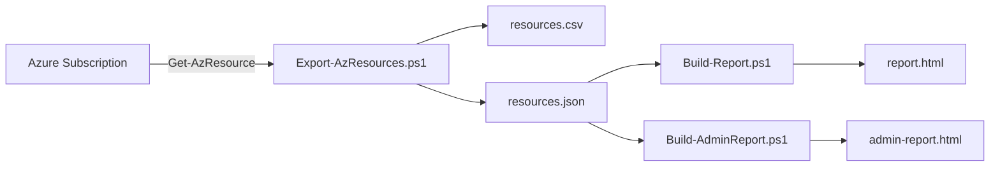

# Azure PowerShell インベントリ＆レポーティング デモ

Azure サブスクリプションのリソース情報を **Azure PowerShell (Az モジュール)** で取得し、
**CSV / JSON / 閲覧用 HTML / 管理者向け AI インサイト HTML** の 4 つの成果物に加工する
デモ用ワークスペースです。

> このワークスペースは [Dev Container](https://containers.dev/) で動作するように構成済みです。
> ホスト OS に Az モジュールや PowerShell 7 を入れずに、誰でも同じ環境で再現できます。

---

## 1. このワークスペースで何ができるのか

| # | スクリプト | 出力 | 概要 |
|---|---|---|---|
| 1 | [`Export-AzResources.ps1`](Export-AzResources.ps1) | `output/resources.csv`<br>`output/resources.json` | サインイン中サブスクリプションの全リソースを `Get-AzResource` で取得し、Excel 互換 CSV と JSON にエクスポート |
| 2 | [`Build-Report.ps1`](Build-Report.ps1) | `output/report.html` | 検索・フィルタ・ソート可能なテーブルと、Chart.js による種類 / リージョン / RG / タグ分布の可視化を行う**閲覧用 HTML レポート** |
| 3 | [`Build-AdminReport.ps1`](Build-AdminReport.ps1) | `output/admin-report.html` | ガバナンス / セキュリティ / 信頼性 / コスト最適化の観点でルールベース解析を行い、Severity 付きの**管理者向け AI インサイト HTML レポート**を生成 (Health Score 計算込み) |

### 実行フロー



---

## 2. クイックスタート

### 2-A. ホストでそのまま実行する場合

前提:
- PowerShell 7+ または Windows PowerShell 5.1
- `Az.Accounts` / `Az.Resources` モジュール
  ```powershell
  Install-Module -Name Az.Accounts, Az.Resources -Scope CurrentUser
  ```

```powershell
Connect-AzAccount
# 必要に応じて: Set-AzContext -Subscription "<サブスクリプション名 or ID>"

.\Export-AzResources.ps1     # CSV / JSON を生成
.\Build-Report.ps1           # 閲覧用 HTML
.\Build-AdminReport.ps1      # 管理者向け HTML
```

### 2-B. Dev Container で実行する場合（推奨）

1. VS Code に **Dev Containers** 拡張 (`ms-vscode-remote.remote-containers`) を導入。
2. Docker Desktop（または互換ランタイム）を起動。
3. このフォルダーを VS Code で開き、コマンドパレットから
   `Dev Containers: Reopen in Container` を実行。
4. 初回はイメージのプルと `Az.Accounts` / `Az.Resources` のインストールが走ります。
5. 統合ターミナル (PowerShell) で:
   ```powershell
   Connect-AzAccount -UseDeviceAuthentication
   .\Export-AzResources.ps1
   .\Build-Report.ps1
   .\Build-AdminReport.ps1
   ```
6. `output/report.html` / `output/admin-report.html` を右クリック → **Open with Live Server** でブラウザにプレビュー (ポート 5500 はホストへ自動転送されます)。

---

## 3. なぜ Dev Container 化するのか

このリポジトリは「**Azure PowerShell + 静的 HTML レポート生成**」という
比較的シンプルな構成ですが、デモ・ハンズオン・社内研修・お客様提供といった
**他人の PC で動かす**シーンが多いことを想定しています。Dev Container にしておくと
以下のメリットが得られます。

| 観点 | 効果 |
|---|---|
| **環境の一貫性** | PowerShell 7 + Az モジュールのバージョンを固定。「自分の環境では動くんだけど…」を排除 |
| **オンボーディング高速化** | 受け取った人は Reopen in Container を押すだけで実行可能。Az モジュールのインストール待ちもスクリプトが自動化 |
| **ホストを汚さない** | デモ用のモジュールがホストの PowerShell プロファイルに混ざらない。複数バージョンの Az を切り替える事故も防げる |
| **OS 非依存** | macOS / Linux / Windows + WSL いずれの開発者でも同じ pwsh on Linux で再現できる |
| **CI/CD への流用** | 同じ `devcontainer.json` の image を GitHub Actions の `container:` 句にも使えるので、ローカルと CI のドリフトを抑えられる |
| **拡張機能の自動装備** | チーム全員が `ms-vscode.powershell`, `ms-azuretools.*`, `live-server` 等を揃った状態で開ける |
| **デモ準備時間の削減** | 顧客先 / 別マシンに移動した直後でも、Docker さえあれば数分でデモ可能 |

なお、Azure への認証はコンテナ内で
`Connect-AzAccount -UseDeviceAuthentication` を使うため、
**ホストのブラウザ / 資格情報をマウントせずに**サインインできます（コンテナ廃棄でトークンも消える、安全な運用が可能）。

---

## 4. ファイル構成

```
.
├── .devcontainer/
│   ├── devcontainer.json    # PowerShell 7 + Az ベースの Dev Container 定義
│   └── setup.ps1            # postCreateCommand で実行するモジュール導入スクリプト
├── .vscode/
│   ├── extensions.json      # 推奨拡張 (Azure / PowerShell / Live Server / Containers)
│   └── settings.json        # PowerShell フォーマット & Live Server 設定
├── Export-AzResources.ps1   # ① CSV / JSON エクスポート
├── Build-Report.ps1         # ② 閲覧用 HTML
├── Build-AdminReport.ps1    # ③ 管理者向け AI インサイト HTML
├── output/                  # 生成物 (Git 管理対象外推奨)
│   ├── resources.csv
│   ├── resources.json
│   ├── report.html
│   └── admin-report.html
└── README.md
```

---

## 5. 注意事項

- 出力 HTML は CDN から Chart.js を読み込むため、閲覧時にインターネット接続が必要です。
- `Build-AdminReport.ps1` の "AI インサイト" は LLM ではなく、**ルールベースの決定的な解析**で生成しています（再現性とプライバシーを優先）。LLM 連携が必要な場合は `Insights` 構築部を Azure OpenAI 呼び出しに差し替えるだけで拡張可能です。
- 実行には対象サブスクリプションへの **Reader 以上**のロールが必要です。
