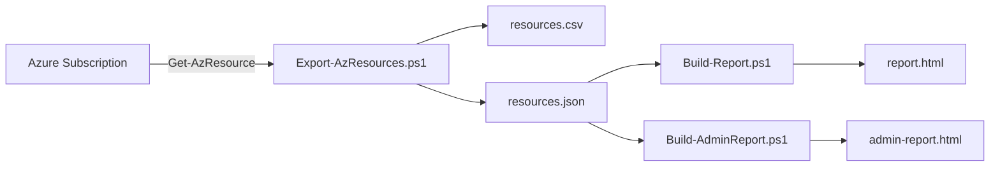

# Azure PowerShell インベントリ＆レポーティング デモ

Azure サブスクリプションのリソース情報を **Azure PowerShell (Az モジュール)** で取得し、
**CSV / JSON / 閲覧用 HTML / 管理者向け AI インサイト HTML** の 4 つの成果物に加工する
デモ用ワークスペースです。

> このワークスペースは [Dev Container](https://containers.dev/) で動作するように構成済みです。
> ホスト OS に Az モジュールや PowerShell 7 を入れずに、誰でも同じ環境で再現できます。

---

## 1. このワークスペースで何ができるのか

| # | スクリプト | 出力 | 概要 |
|---|---|---|---|
| 1 | [`Export-AzResources.ps1`](Export-AzResources.ps1) | `output/resources.csv`<br>`output/resources.json` | サインイン中サブスクリプションの全リソースを `Get-AzResource` で取得し、Excel 互換 CSV と JSON にエクスポート |
| 2 | [`Build-Report.ps1`](Build-Report.ps1) | `output/report.html` | 検索・フィルタ・ソート可能なテーブルと、Chart.js による種類 / リージョン / RG / タグ分布の可視化を行う**閲覧用 HTML レポート** |
| 3 | [`Build-AdminReport.ps1`](Build-AdminReport.ps1) | `output/admin-report.html` | ガバナンス / セキュリティ / 信頼性 / コスト最適化の観点でルールベース解析を行い、Severity 付きの**管理者向け AI インサイト HTML レポート**を生成 (Health Score 計算込み) |

### 実行フロー



---

## 2. クイックスタート

### 2-A. ホストでそのまま実行する場合

前提:
- PowerShell 7+ または Windows PowerShell 5.1
- `Az.Accounts` / `Az.Resources` モジュール
  ```powershell
  Install-Module -Name Az.Accounts, Az.Resources -Scope CurrentUser
  ```

```powershell
Connect-AzAccount
# 必要に応じて: Set-AzContext -Subscription "<サブスクリプション名 or ID>"

.\Export-AzResources.ps1     # CSV / JSON を生成
.\Build-Report.ps1           # 閲覧用 HTML
.\Build-AdminReport.ps1      # 管理者向け HTML
```

### 2-B. Dev Container で実行する場合（推奨）

1. VS Code に **Dev Containers** 拡張 (`ms-vscode-remote.remote-containers`) を導入。
2. Docker Desktop（または互換ランタイム）を起動。
3. このフォルダーを VS Code で開き、コマンドパレットから
   `Dev Containers: Reopen in Container` を実行。
4. 初回はイメージのプルと `Az.Accounts` / `Az.Resources` のインストールが走ります。
5. 統合ターミナル (PowerShell) で:
   ```powershell
   Connect-AzAccount -UseDeviceAuthentication
   .\Export-AzResources.ps1
   .\Build-Report.ps1
   .\Build-AdminReport.ps1
   ```
6. `output/report.html` / `output/admin-report.html` を右クリック → **Open with Live Server** でブラウザにプレビュー (ポート 5500 はホストへ自動転送されます)。

---

## 3. なぜ Dev Container 化するのか

このリポジトリは「**Azure PowerShell + 静的 HTML レポート生成**」という
比較的シンプルな構成ですが、デモ・ハンズオン・社内研修・お客様提供といった
**他人の PC で動かす**シーンが多いことを想定しています。Dev Container にしておくと
以下のメリットが得られます。

| 観点 | 効果 |
|---|---|
| **環境の一貫性** | PowerShell 7 + Az モジュールのバージョンを固定。「自分の環境では動くんだけど…」を排除 |
| **オンボーディング高速化** | 受け取った人は Reopen in Container を押すだけで実行可能。Az モジュールのインストール待ちもスクリプトが自動化 |
| **ホストを汚さない** | デモ用のモジュールがホストの PowerShell プロファイルに混ざらない。複数バージョンの Az を切り替える事故も防げる |
| **OS 非依存** | macOS / Linux / Windows + WSL いずれの開発者でも同じ pwsh on Linux で再現できる |
| **CI/CD への流用** | 同じ `devcontainer.json` の image を GitHub Actions の `container:` 句にも使えるので、ローカルと CI のドリフトを抑えられる |
| **拡張機能の自動装備** | チーム全員が `ms-vscode.powershell`, `ms-azuretools.*`, `live-server` 等を揃った状態で開ける |
| **デモ準備時間の削減** | 顧客先 / 別マシンに移動した直後でも、Docker さえあれば数分でデモ可能 |

なお、Azure への認証はコンテナ内で
`Connect-AzAccount -UseDeviceAuthentication` を使うため、
**ホストのブラウザ / 資格情報をマウントせずに**サインインできます（コンテナ廃棄でトークンも消える、安全な運用が可能）。

---

## 4. ファイル構成

```
.
├── .devcontainer/
│   ├── devcontainer.json    # Dev Container の定義本体 (ベースイメージ・拡張・ポート転送など)
│   └── setup.ps1            # コンテナ作成後に走る Az モジュール導入スクリプト
├── .vscode/
│   ├── extensions.json      # 推奨拡張 (Azure / PowerShell / Live Server / Containers)
│   └── settings.json        # PowerShell フォーマット & Live Server 設定
├── Export-AzResources.ps1   # ① CSV / JSON エクスポート
├── Build-Report.ps1         # ② 閲覧用 HTML
├── Build-AdminReport.ps1    # ③ 管理者向け AI インサイト HTML
├── output/                  # 生成物 (Git 管理対象外推奨)
│   ├── resources.csv
│   ├── resources.json
│   ├── report.html
│   └── admin-report.html
└── README.md
```

### 4-1. `.devcontainer/` の中身 (Dev Container 初心者向け)

このリポジトリは **Dev Container を最小構成** で運用しています。`.devcontainer/` 配下に置いてあるのは次の 2 ファイルだけです。両方とも必須で、これだけあれば `Reopen in Container` で動きます。

#### [`devcontainer.json`](.devcontainer/devcontainer.json) — コンテナの設計図

VS Code Dev Containers が読み込む設定ファイル本体です。主要なキーの意味は以下のとおり。

| キー | 役割 | このリポジトリでの値 |
|---|---|---|
| `image` | コンテナのベース OS | `mcr.microsoft.com/devcontainers/base:bookworm` (Debian 12) |
| `features` | ベースイメージに後から足す機能。Microsoft が公開している部品集 | `common-utils` (sudo / 一般ユーザー周り) と `powershell` (PowerShell 7) を追加 |
| `postCreateCommand` | コンテナを作り終えた直後に 1 回だけ実行されるコマンド | `setup.ps1` を pwsh で呼び出して Az モジュールを入れる |
| `customizations.vscode.extensions` | コンテナ内 VS Code に自動で入れる拡張 | PowerShell / Azure 系 / Live Server / Copilot |
| `customizations.vscode.settings` | コンテナ内 VS Code の既定設定 | 既定ターミナルを `pwsh`、改行コードを LF に固定 |
| `forwardPorts` | コンテナ内ポートをホストへ自動転送 | `5500` (Live Server で HTML プレビュー用) |
| `portsAttributes` | 転送ポートの挙動 | `5500` を「Live Server (HTML Reports)」とラベル付けし、自動でブラウザを開く |
| `remoteUser` | コンテナ内で使うユーザー | `vscode` (root を使わない安全側の既定) |

> 💡 `image` + `features` の組み合わせを使うと、Dockerfile を書かずに「Debian にあとから PowerShell を入れた環境」が手に入ります。Dockerfile を自分で書きたくなるまでは、これが最も簡単な構成です。

#### [`setup.ps1`](.devcontainer/setup.ps1) — モジュール導入の自動化

`postCreateCommand` から呼ばれる初期化スクリプトです。やっていることは 3 つだけ。

1. **進捗表示の抑制** — `$ProgressPreference = 'SilentlyContinue'` で進捗バーによる stdout 詰まりを回避。
2. **PSGallery を Trusted 化** — 毎回の確認プロンプトを止める。
3. **`Az.Resources` をインストール** — `Az.Accounts` は依存として自動で入るため、明示インストールしない (重複・遅延回避)。`Install-PSResource` (PSResourceGet) が使えれば優先し、無ければ `Install-Module` にフォールバック。

> 💡 ここを編集すれば、たとえば `Az.Monitor` や `Az.CostManagement` を追加する、Pester や PSScriptAnalyzer を入れる、など簡単に拡張できます。

#### 「`devcontainer-lock.json` は要らないの？」

`features` を使うと VS Code が `devcontainer-lock.json` を自動生成して各 Feature のバージョンを SHA256 で固定することがあります。**このリポジトリではデモ用途を優先して最小構成のため意図的に置いていません。** 必要であれば `Dev Containers: Rebuild Container` 実行時に再生成されます。本番運用で「再ビルド時にバージョンが勝手にズレるのが許せない」ケースのみ、生成されたファイルをコミットして固定する運用に切り替えてください。

---

## 5. 注意事項

- 出力 HTML は CDN から Chart.js を読み込むため、閲覧時にインターネット接続が必要です。
- `Build-AdminReport.ps1` の "AI インサイト" は LLM ではなく、**ルールベースの決定的な解析**で生成しています（再現性とプライバシーを優先）。LLM 連携が必要な場合は `Insights` 構築部を Azure OpenAI 呼び出しに差し替えるだけで拡張可能です。
- 実行には対象サブスクリプションへの **Reader 以上**のロールが必要です。
